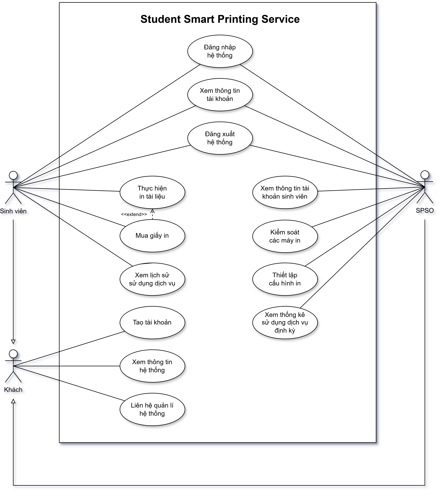
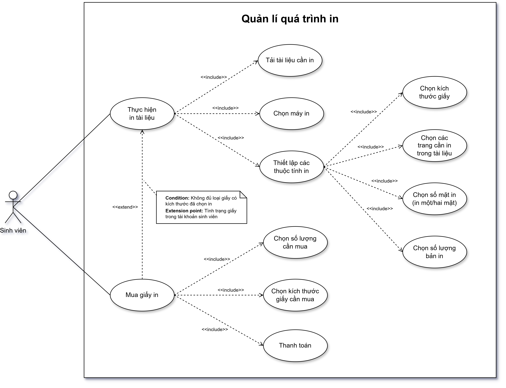

# Yêu cầu nghiệp vụ - Requirement

## 1. Phân tích ngữ cảnh
**Yêu cầu:** Mô tả bối cảnh của dịch vụ in ấn thông minh dành cho sinh viên tại Trường Đại học Bách khoa - ĐHQG-HCM (HCMUT_SSPPS - Student Smart Printing Service). Cho biết các bên liên quan trong dịch vụ này. Theo bạn, những lợi ích của hệ thống HCMUT_SSPPS dành cho từng bên liên quan là gì?

### Đặt vấn đề

Hiện nay, ngoài nhu cầu in ấn đề thi, kiểm tra của các trường đại học thì việc in các tài liệu học tập, slide bài giảng đang trở nên ngày càng phổ biến và hữu ích đối với các sinh viên trong quá trình học tập. Đứng trước thực tại ấy, các phương thức cung cấp dịch vụ in truyền thống ở các văn phòng phẩm hiện nay vẫn còn một số hạn chế:

- **Các trở ngại vật lí.** Nhiều hạn chế như vị trí vật lí, giá cả mặt bằng, trở ngại cho người dùng khi phải di chuyển đến tận nơi để sử dụng dịch vụ,...
- **Hạn chế về thời gian.** Khi nhu cầu sử dụng dịch vụ tăng cao dẫn đến sự quá tải, làm mất thời gian cho chờ đợi.
- **Vấn đề bảo mật thông tin.** Khi sinh viên gửi tài liệu cho máy tính ở văn phòng phẩm sẽ không được đảm bảo riêng tư. Những nội dung cá nhân có thể bị tiết lộ, gây ảnh hưởng đến quá trình học tập của sinh viên.
- **Tùy chỉnh in ấn có thể gây khó khăn.** Máy tính ở văn phòng phẩm không đảm bảo về hình thức văn bản so với tệp tin gốc, dẫn đến lỗi thiết kế, gây cản trở, khó khăn cho tùy chỉnh in ấn.
- **Người dùng khó nắm bắt được chi phí.** Dịch vụ in thông thường hiện nay thường không niêm yết giá, không có hóa đơn, dẫn đến sự khó khăn trong việc nắm bắt giá cả, khó thống kê kiểm soát chi tiêu cho sinh viên.

### Giải pháp đặt ra
Hệ thống dịch vụ in HCMUT_SSPPS được phát triển để giải quyết các vấn đề còn tồn đọng ở các văn phòng in truyền thống. Cụ thể:

- **Thiết lập nhiều cơ sở in trong trường học.** Các máy in được thiết lập ở nhiều nơi trong khuôn viên trường, giúp việc đi lại sử dụng dịch vụ của sinh viên trở nên thuận tiện. Sinh viên có thể lựa chọn sử dụng bất kỳ máy in nào phù hợp, thuận tiện nhất với nhu cầu của bản thân, tiết kiệm thời gian.
- **Khắc phục hạn chế bảo mật.** Sinh viên được yêu cầu đăng nhập tài khoản trước khi truy cập vào sử dụng ứng dụng. Sinh viên có riêng tất cả quyền sử dụng dịch vụ, hạn chế vấn đề bảo mật cá nhân cho người dùng.
- **Dễ dàng tùy chỉnh in ấn.** Ứng dụng HCMUT_SSPPS cung cấp dịch vụ (lựa chọn máy in, nhập các tệp cần in, thiết lập các tùy chỉnh in ấn như kích thước giấy, giới hạn các trang muốn in có trong tệp, in một hoặc hai mặt giấy, số lượng bản in,...). Sinh viên tự thiết lập các thuộc tính ấy, mang lại tính thuận tiện, tùy chỉnh cho sinh viên trong việc sử dụng.
- **Người sử dụng có rõ thông tin về giá cả.** Phí sử dụng dịch vụ được niêm yết dựa theo cỡ trang giấy. Mỗi sinh viên khi sử dụng dịch vụ in cần mua giấy (hoặc đã có sẵn do được trường cung cấp vào mỗi học kỳ, hoặc còn tồn lại trong tài khoản do đã mua trước đó). Bằng việc công khai giá như trên sẽ giúp sinh viên dễ dàng nắm bắt được chi phí trước khi sử dụng dịch vụ.
- **Hệ thống thanh toán thuận tiện.** Việc mua giấy in được thực hiện thông qua hệ thống thanh toán trực tuyến tương tự BKPay của trường. Bằng việc thanh toán như thế, sinh viên sẽ giảm thiểu những hạn chế của việc sử dụng tiền mặt (cồng kềnh, thối lại tiền thừa,...).
- **Cho phép người dùng xem lại lịch sử sử dụng dịch vụ và thống kê chi phí.** Lịch sử sử dụng dịch vụ, mua giấy in được lưu trữ trong hệ thống, sinh viên có thể truy cập để xem lại các hoạt động cũng như thống kê được chi tiêu của mình cho việc sử dụng dịch vụ.

### Các bên liên quan (stakeholder) & lợi ích của các bên liên quan

#### Sinh viên trường Đại học Bách khoa - ĐHQG-HCM
Sinh viên là đối tượng chính sử dụng dịch vụ. Nhu cầu của sinh viên là có thể thực hiện in ấn tài liệu một cách nhanh chóng, chi phí hợp lý, phương thức thanh toán hiện đại.

HCMUT_SSPPS sẽ cung cấp cho sinh viên dịch vụ in ấn thuận tiện, tiết kiệm thời gian và công sức, cho sinh viên được toàn quyền tải tài liệu, thiết lập các định dạng bản in. Đồng thời cho phép người dùng xem lại lịch sử, truy vấn chi tiêu sử dụng dịch vụ.

#### Nhà quản lí hệ thống dịch vụ (SPSO - Student Printing Service Officer)
SPSO là bên quản lý, họ có nhu cầu giám sát các hoạt động sử dụng dịch vụ in ấn của sinh viên, cài đặt khả năng sử dụng máy in cho sinh viên. Đồng thời họ có thể nhận được lợi ích kinh tế từ doanh thu của dịch vụ này.

HCMUT_SSPPS sẽ cung cấp cho SPSO quyền xem lịch sử in ấn của các sinh viên. Bên cạnh đó họ còn được dịch vụ cung cấp khả năng đưa ra các thiết lập bản in để sinh viên sử dụng (giới hạn loại tệp, giới hạn kích thước giấy, giá một trang giấy,...).

#### Người phát triển dịch vụ (Service Developer)
Họ thực hiện lên ý tưởng, viết chương trình, sử dụng các công nghệ liên quan cho việc tạo dựng, phát triển hệ thống. Đồng thời, họ cũng phát triển các tính năng mới khi cần thiết, sửa lỗi và cải thiện hiệu suất.

HCMUT_SSPPS sẽ mang lại lợi nhuận kinh tế cho bên liên quan này. Bên cạnh đó dịch vụ còn giúp quảng bá hình ảnh, thương hiệu của người phát triển ứng dụng. Cuối cùng, người phát triển có cơ hội đảm nhận việc thực hiện dự án, từ đó tích lũy thêm kinh nghiệm, kỹ năng nhằm nâng cao khả năng nghề nghiệp của bản thân.

#### Trường Đại học Bách khoa - ĐHQG-HCM (HCMUT)
Là nhà đầu tư, đưa hệ thống vào phục vụ sinh viên, là nơi bố trí các máy in cho dịch vụ. Họ có nhu cầu cung cấp dịch vụ in ấn thông minh cho sinh viên. Họ cũng có thể nhận được lợi ích kinh tế từ doanh thu của dịch vụ này. Họ mong muốn thể hiện sự quan tâm của họ đối với nhu cầu của sinh viên, từ đó nâng cao vị thế của trường đối với sinh viên đang theo học tại trường cũng như với cá nhân, tổ chức bên ngoài.

#### Nhà cung cấp máy in

Nhà cung cấp máy in là các công ty hoặc tổ chức cung cấp thiết bị và công nghệ in ấn cho dịch vụ HCMUT_SSPS. Nhu cầu của họ bao gồm việc cung cấp sản phẩm và giải pháp in ấn đáp ứng yêu cầu của hệ thống, đảm bảo tính ổn định và hiệu suất hoạt động của thiết bị. Họ cũng mong muốn quảng bá thương hiệu và tăng doanh số bán hàng thông qua việc hợp tác với trường Đại học Bách Khoa.

HCMUT_SSPS mang lại cơ hội để nhà cung cấp quảng bá thương hiệu: Máy in được sử dụng trong hệ thống sẽ là một cơ hội để nhà cung cấp tăng sự nhận diện và độ tin cậy thương hiệu trong môi trường học thuật. Đồng thời, thông qua việc hợp tác với HCMUT có thể dẫn đến các cơ hội hợp tác với các tổ chức giáo dục khác.

#### Hệ thống thanh toán trực tuyến
Hệ thống là phương tiện thanh toán của sinh viên khi sử dụng dịch vụ, là bên trực tiếp kiểm soát lợi nhuận dịch vụ thu được. Họ có nhu cầu tích hợp vào dịch vụ này.

HCMUT_SSPPS sẽ là cơ hội để bên cung cấp thanh toán trực tuyến có cho thấy lợi ích của việc thanh toán điện tử, từ đó mở rộng phạm vi khách hàng có nhu cầu sử dụng hình thức thanh toán này.

#### Khách
Là người không (hoặc chưa) đăng nhập vào hệ thống. Họ mong muốn tìm hiểu thông tin của dịch vụ này, cách sử dụng, chi phí khi dùng dịch vụ.

HCMUT_SSPPS cung cấp cho họ các thông tin về dịch vụ của mình, tư vấn giúp họ đưa ra quyết định sử dụng dịch vụ, hỗ trợ tạo tài khoản.

## 2. Phân tích yêu cầu

**Yêu cầu:** Mô tả chi tiết các yêu cầu chức năng và phi chức năng có thể suy ra từ mô tả dự án.

### Yêu Cầu Chức Năng

#### Sinh viên trường Đại học Bách khoa - ĐHQG-HCM
- Sinh viên có thể truy cập và xem thông tin cá nhân của mình.
- Có quyền tải tập tin từ thiết bị cá nhân lên hệ thống.
- Cho phép chọn máy in theo vị trí mong muốn.
- Các tùy chọn thiết lập thông số in ấn.
- Xem số trang in đang sở hữu.
- Nhận một lượng trang in nhất định mỗi học kỳ và có thể mua thêm qua hệ thống thanh toán điện tử tích hợp.
- Truy vấn lịch sử các lần sử dụng dịch vụ.

#### Nhà quản lí hệ thống dịch vụ (SPSO - Student Printing Service Officer)
- Được cấp quyền quản lí cho tài khoản.
- Truy cập và xem thông tin tài khoản của tất cả sinh viên.
- Quản lý và kiểm soát máy in trong hệ thống (thêm, kích hoạt hoặc vô hiệu hóa máy in).
- Quản lý các cấu hình in ấn, giới hạn loại tệp sinh viên có thể tải lên.
- Tạo và truy cập các báo cáo số liệu thống kê định kỳ.

#### Khách
- Có thể truy cập trang web và tìm hiểu thông tin dịch vụ.

### Yêu Cầu Phi Chức Năng
- **Hiệu suất:** Dịch vụ phải đảm bảo khả năng phục vụ nhiều sinh viên đồng thời mà không bị gián đoạn hoặc quá tải.
- **Bảo mật:** Thông tin tài khoản, lịch sử và các tài liệu phải được bảo mật.
- **Khả năng mở rộng:** Dịch vụ phải có thể dễ dàng mở rộng với số lượng sinh viên lớn hơn trong tương lai.
- **Tính khả dụng:** Hệ thống phải sẵn sàng 24/7, đặc biệt trong mùa thi.
- **Tính dễ sử dụng:** Giao diện người dùng phải trực quan, dễ sử dụng và phù hợp với sinh viên.

## 3. Use case diagram

### Cho toàn bộ hệ thống

### Bảng mô tả use case

**Các use case cần mô tả:**

| **Mã Use Case** | **Tên Use Case**                      | **Mô tả**                                                                 |
|-----------------|---------------------------------------|---------------------------------------------------------------------------|
| UC001           | Tạo tài khoản                        | Khách tạo tài khoản để tham gia hệ thống                                 |
| UC002           | Đăng nhập                            | Người dùng đăng nhập vào hệ thống                                         |
| UC003           | Mua giấy in                          | Sinh viên mua thêm giấy                                                   |
| UC004           | In tài liệu                          | Sinh viên sử dụng dịch vụ in tài liệu                                     |
| UC005           | Xem lịch sử sử dụng dịch vụ          | Sinh viên xem các hoạt động cá nhân đã thực hiện trên hệ thống            |
| UC006           | Quản lí máy in                       | SPSO kiểm soát các máy in trong hệ thống                                  |
| UC007           | Quản lí cấu hình in                  | SPSO thiết lập giới hạn các cấu hình in sinh viên có thể sử dụng          |
| UC008           | Xem tất cả lịch sử sử dụng dịch vụ    | SPSO xem hoạt động của các sinh viên đã thực hiện trên hệ thống           |
| UC009           | Xem thống kê định kì                 | SPSO xem thống kê các số liệu (lượt truy cập, lượt sử dụng, tổng số tiền) của hệ thống theo định kì |

### Use case diagram cho một module quan trọng

