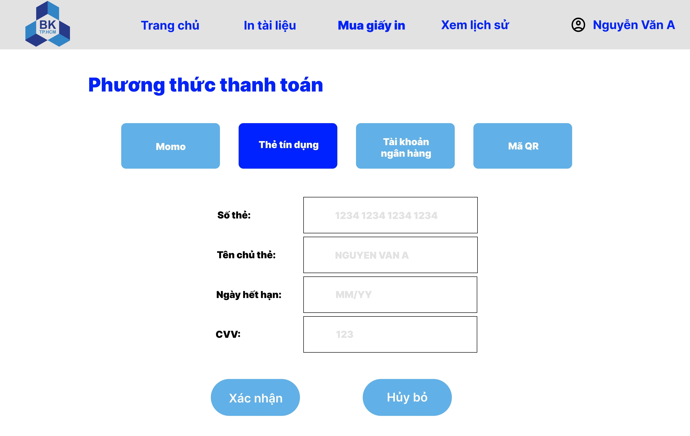

# Mô mình hóa hê thống - System Modeling

## 1. Activity diagram

### Use case Tạo tài khoản

**Mô tả:** Người dùng truy cập vào ứng dụng. Hệ thống hiển thị giao diện trang chủ, trong đó có nơi để người dùng chọn thực hiện tạo tài khoản để tham gia hệ thống. Khi giao diện tạo tài khoản xuất hiện, người dùng cần nhập các thông tin theo yêu cầu (như họ tê, địa chỉ email, số điện thoại, mật khẩu,...). Hệ thống cần kiểm tra xem người dùng đã nhập đủ và hợp lệ các thông tin. Khi người dùng chọn "Đăng ký", hệ thống sẽ gửi một email xác thực đến địa chỉ thư điện tử mà người dùng đã cung cấp. Khi đó, người dùng cần chọn vào đường dẫn trong thư được gửi tới để xác thực tài khoản, hoàn tất quá trình tạo tài khoản.

### Use case Mua giấy in

 

**Mô tả:** Siện viên lựa chọn chức năng mua giấy. Hệ thống hiển thị trang Mua giấy in và yêu cầu người dùng chọn/nhập kích cỡ giấy cùng số lượng mỗi loại. Người dùng điền các thông tin yêu cầu và xác nhận đơn hàng. Hệ thống chuyển sang giao diện thanh toán. Người dùng lựa chọn một trong các phương thức thanh toán khả dụng và điền các thông tin yêu cầu. Hệ thống kiểm tra thông tin người dùng đã nhập và số dư tài khoản. Nếu hợp lệ, hệ thống thực hiện hoàn thành giao dịch mua giấy in của người dùng.

### Use case In tài liệu

**Mô tả:** Sau khi sinh viên đăng nhập vào hệ thống thành công, sinh viên chọn chức năng "In tài liệu". Hệ thống sẽ yêu cầu kiểm tra tài liệu trong kho của sinh viên. Nếu có tài liệu, hệ thống cho phép sinh viên chọn tài liệu cần in. Nếu không có, hệ thống yêu cầu sinh viên "Tạo tài liệu mới". Trong quy trình tạo tài liệu mới, sinh viên chọn tệp tin cần tải lên và xác nhận tệp tin đã chọn. Hệ thống kiểm tra loại tài liệu: nếu loại tệp không phù hợp, hệ thống báo lỗi và yêu cầu sinh viên chọn lại; nếu tệp tin trùng tên với tài liệu đã có, hệ thống đề xuất ghi đè hoặc hủy. Khi tài liệu tải lên thành công, hệ thống ghi nhận lịch sử tải lên của sinh viên và quay lại bước "In tài liệu". Sinh viên thiết lập các tùy chọn in như kích thước trang và số lượng trang cần in, chọn máy in từ danh sách có sẵn. Hệ thống kiểm tra tình trạng máy in: nếu máy in đủ giấy, hệ thống xác nhận lệnh in; nếu không đủ giấy, hệ thống thông báo lỗi và yêu cầu sinh viên chọn máy in khác. Sinh viên xác nhận yêu cầu in của mình, sau đó hệ thống gửi lệnh in đến máy in đã chọn. Cuối cùng, sinh viên nhận bản in từ máy in và hệ thống ghi nhận lịch sử sử dụng dịch vụ in. Quy trình kết thúc khi sinh viên hoàn tất việc in tài liệu.

### Use case Xem lịch sử sử dụng dịch vụ

**Mô tả:** Hệ thống cho phép sinh viên xem lịch sử sử dụng dịch vụ khi lựa chọn vào "Xem lịch sử". Hệ thống sẽ hiển thị danh sách lịch sử của sinh viên. Người dùng chọn một lịch sử cụ thể để xem chi tiết. Đồng thời, nguời dùng cũng có thể lựa chọn thiết lập trong lịch sử này làm thiết lập mặc định cho các lần sau.

### Use case Quản lý cấu hình in

**Mô tả:** SPSO đăng nhập vào hệ thống dịch vụ in ấn thông minh cho sinh viên trường Đại học Bách khoa. SPSO chọn chức năng thiết lập quản lí cấu hình in. Tiếp tục chọn một trong các chức năng trên trang hiển thị: "Thiết lập tệp in", "Thiết lập cấp phát trang in", "Thiết lập bản in".

- **Thiết lập tệp in:** SPSO tiến hành thiết lập các định dạng tệp cho phép sinh viên sử dụng dịch vụ in ấn. Nếu chọn định dạng không phù hợp hoặc chưa hỗ trợ thì hệ thống báo lỗi và yêu cầu SPSO chọn lại. Nếu thành công thì hệ thống cập nhật theo yêu cầu của SPSO.
- **Thiết lập cấp phát trang in:** SPSO tiến hành thiết lập cấp phát số trang in ứng với mỗi loại giấy cho phép sinh viên in mỗi tháng với số lượng giới hạn và cấp phát thêm nếu sinh viên mua thêm số lượng trang in. Nếu chọn số trang in và loại trang không phù hợp thì hệ thống báo lỗi và yêu cầu nhập lại, nếu chọn và thiết lập hợp lệ thì hệ thống thông cáo thành công và cấp phát số trang in cho sinh viên.
- **Thiết lập bản in:** SPSO tiến hành thiết lập thông số của trang in bao gồm loại kích thước trang được in ra, số trang copy tối đa mà sinh viên có thể in trong một lần. Nếu thông số nhập hợp lệ thì hệ thống thông báo thành công và cập nhật theo yêu cầu của SPSO, nếu không hợp lệ thì hệ thống báo lỗi và yêu cầu nhập lại.

## 2. Sequence diagram

### Use case Tạo tài khoản:

<!-- \input{Contents/Main/sequence-diagram/1-signUp} -->

---

### Use case Mua giấy in:

<!-- \input{Contents/Main/sequence-diagram/2-buyPaper} -->

---

### Use case In tài liệu:

<!-- \input{Contents/Main/sequence-diagram/3-printDocuments} -->

---

### Use case Xem lịch sử sử dụng dịch vụ:

<!-- \input{Contents/Main/sequence-diagram/4-viewPrintingLogsStudent} -->

---

### Use case Quản lý cấu hình in:

<!-- \input{Contents/Main/sequence-diagram/5-manageConfig} -->

 

## 3. Class diagram

<!-- \input{Contents/Main/class-diagram/printDocumentsManagementModule} -->

---

## 4. Thiết kế MVP (Minimum Viable Product - sản phẩm khả dụng)

### Giao diện Trang chủ

 

---

### Giao diện Đăng ký tài khoản

 

---

### Giao diện Trang chủ sau đăng nhập

<table>
  <tr>
    <td>
      
    </td>
    <td>
      
    </td>
  </tr>
</table>

---

### Giao diện Mua giấy in

<table>
  <tr>
    <td>
      
    </td>
    <td>
      
    </td>
  </tr>
</table>

---

### Giao diện In tài liệu

<table>
  <tr>
    <td>
      
    </td>
    <td>
      
    </td>
  </tr>
</table>

 

<table>
  <tr>
    <td>
      
    </td>
    <td>
      
    </td>
  </tr>
</table>

---

### Giao diện Xem lịch sử sử dụng dịch vụ

<table>
  <tr>
    <td>
      
    </td>
    <td>
      
    </td>
  </tr>
</table>

