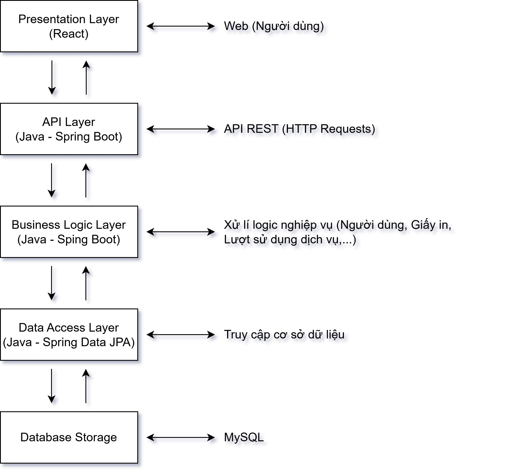
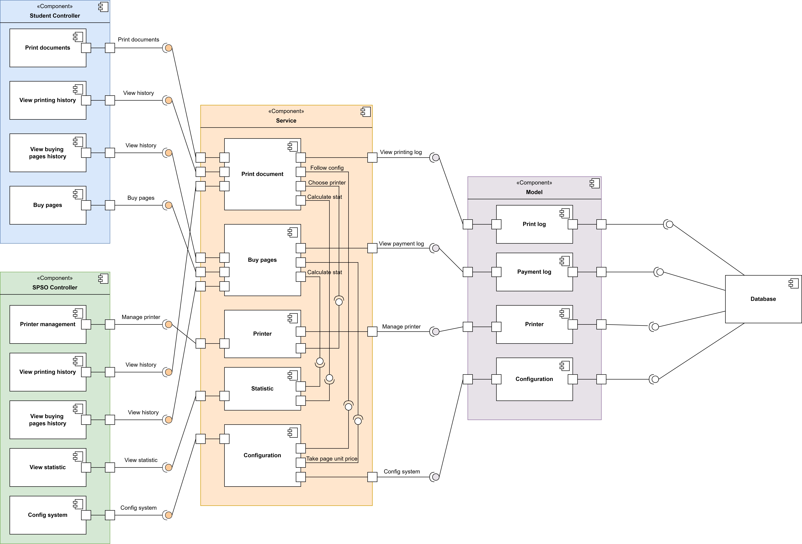

# Architecture Design - Thiết kế kiến trúc

## 1. Kiến trúc phân lớp - Layerd architecture

Hệ thống sẽ được thiết kế dựa trên mô hình kiến trúc phân năm lớp:

### Presentation Layer

Lớp Presentation là tầng giao diện của hệ thống, nơi người dùng tương tác trực tiếp với các dịch vụ. Lớp này chịu trách nhiệm quản lý toàn bộ phần front-end và xử lý các thao tác từ phía người dùng, bao gồm hai nhóm đối tượng chính là sinh viên và các thành viên SPSO. Khi người dùng truy cập vào hệ thống và đăng nhập, giao diện sẽ tự động hiển thị các tính năng và quyền hạn tương ứng. Ví dụ, sinh viên chỉ có thể nhìn thấy các tài liệu mà họ đã tải lên hoặc gửi yêu cầu in ấn, trong khi các thành viên SPSO có thể truy cập các chức năng cấu hình máy in như cài đặt số lượng trang in, chế độ in, và quản lý thứ tự in ấn. Lớp Presentation được xây dựng bằng React, giúp việc phát triển giao diện trở nên linh hoạt và dễ bảo trì. Hơn nữa, giao diện được thiết kế với tính năng responsive, giúp tự động điều chỉnh bố cục và hiển thị một cách tối ưu trên các thiết bị có kích thước màn hình khác nhau.

---

### API Layer

API Layer đóng vai trò là cầu nối giữa Presentation Layer và Business Logic Layer, giúp truyền tải dữ liệu và thực hiện các yêu cầu từ phía người dùng thông qua các giao thức API REST và GraphQL. Lớp này được xây dựng bằng Spring Boot, cung cấp nền tảng mạnh mẽ để triển khai các dịch vụ web RESTful, giúp việc giao tiếp giữa các tầng trở nên dễ dàng và nhất quán. Khi người dùng thực hiện một thao tác như đăng nhập, tải lên tài liệu, hoặc yêu cầu in ấn, API Layer sẽ tiếp nhận yêu cầu này, xác thực và phân tích trước khi chuyển đến lớp Business Logic để xử lý chi tiết. Sau khi hoàn thành xử lý, API Layer sẽ gửi phản hồi trở lại cho Presentation Layer để hiển thị kết quả cho người dùng. Lớp này cũng đảm bảo các yêu cầu quan trọng phải qua các bước xác thực và ủy quyền nhằm ngăn chặn các truy cập không hợp lệ và bảo vệ dữ liệu nhạy cảm. Nhờ khả năng mở rộng linh hoạt, API Layer cho phép dễ dàng bổ sung hoặc sửa đổi các API khi hệ thống cần phát triển thêm các tính năng mới mà không ảnh hưởng đến các thành phần khác.

---

### Business Logic Layer

Business Logic Layer là lớp trung tâm, nơi thực hiện các quy tắc và quy trình nghiệp vụ của hệ thống quản lý dịch vụ. Lớp này chịu trách nhiệm xử lý các quy trình liên quan đến quyền hạn và hạn mức in ấn của từng đối tượng người dùng, đảm bảo các yêu cầu từ sinh viên và SPSO được xử lý chính xác và hợp lệ. Ví dụ, khi sinh viên gửi yêu cầu in ấn, lớp Business Logic sẽ kiểm tra số trang còn lại trong hạn mức cá nhân, tính toán chi phí in, và ghi nhận lịch sử in vào hệ thống để đảm bảo tính minh bạch và cung cấp báo cáo sau này. Ngoài ra, lớp này còn đảm nhiệm quản lý quyền sở hữu tài liệu, xác thực người dùng trước khi cho phép in và đảm bảo sinh viên chỉ có thể xem các tài liệu mà họ đã tải lên, bảo vệ quyền riêng tư và bảo mật dữ liệu. 

Business Logic Layer cũng đóng vai trò quản lý cấu hình máy in, bao gồm điều chỉnh các thiết lập in ấn, theo dõi tình trạng máy, và xử lý thứ tự các yêu cầu in ấn. Chỉ có các thành viên SPSO mới được phép thay đổi cấu hình của máy in, nhằm ngăn chặn việc thay đổi không mong muốn và đảm bảo tính ổn định của hệ thống. Lớp này còn có các cơ chế tự động thông báo cho người quản trị khi máy in gặp sự cố hoặc cần bảo trì, giúp hệ thống duy trì hiệu suất cao và hoạt động liên tục. Các quy trình trong lớp Business Logic được triển khai bằng Java, tận dụng khả năng ổn định và đáng tin cậy của ngôn ngữ này trong xử lý nghiệp vụ phức tạp, đảm bảo hệ thống vận hành mượt mà và đáp ứng nhanh chóng yêu cầu từ người dùng.

---

### Data Access Layer

Data Access Layer là lớp chịu trách nhiệm kết nối và tương tác trực tiếp với cơ sở dữ liệu, thực hiện các thao tác như truy vấn, thêm, sửa, và xóa dữ liệu. Lớp này sử dụng JPA (Java Persistence API) kết hợp với SQL, giúp ánh xạ các đối tượng Java với các bảng trong cơ sở dữ liệu một cách rõ ràng và dễ quản lý hơn. Data Access Layer đóng vai trò quan trọng trong việc cung cấp các dữ liệu cần thiết cho các thao tác in ấn của sinh viên và SPSO. Lớp này cũng bao gồm các cơ chế để bảo vệ dữ liệu người dùng và đảm bảo tính toàn vẹn của dữ liệu khi có thay đổi. Data Access Layer cung cấp một giao diện ổn định cho các lớp cao hơn truy cập dữ liệu mà không cần quan tâm đến chi tiết cơ sở dữ liệu bên dưới, tạo điều kiện thuận lợi cho việc mở rộng và bảo trì hệ thống.

---

### Data Storage Layer

Trong hệ thống HCMUT_SPS, Data Storage Layer chịu trách nhiệm lưu trữ và quản lý toàn bộ thông tin liên quan đến hoạt động in ấn của sinh viên, quản lý máy in, tài khoản in của sinh viên, và lịch sử in ấn. Lớp này sử dụng MySQL, một hệ quản trị cơ sở dữ liệu quan hệ mạnh mẽ, cho phép lưu trữ dữ liệu có cấu trúc và hỗ trợ việc truy vấn dữ liệu một cách hiệu quả. 

Cấu trúc dữ liệu bao gồm các thông tin người dùng, thông tin về máy in, tài liệu trong kho tài liệu của sinh viên, hạn mức in còn lại, lịch sử nạp tiền, cấu hình của SPSO, và các báo cáo sử dụng hệ thống. Mỗi bảng được thiết kế với các khóa chính và khóa ngoại để duy trì toàn vẹn dữ liệu và đảm bảo mối quan hệ chặt chẽ giữa các thực thể trong hệ thống. Data Storage Layer không trực tiếp giao tiếp với các lớp cao hơn mà thông qua lớp Data Access, đảm bảo rằng mọi thao tác truy xuất dữ liệu đều được kiểm soát và tổ chức.

Bên cạnh đó, MySQL cung cấp các tính năng bảo mật như quyền truy cập, mã hóa, và sao lưu định kỳ, giúp bảo vệ dữ liệu quan trọng của hệ thống. Ngoài ra, để tối ưu hiệu suất, Data Storage Layer có thể áp dụng các phương pháp như phân mảnh dữ liệu, chỉ mục và tối ưu hóa truy vấn, đảm bảo hệ thống đáp ứng nhanh chóng các yêu cầu truy cập dữ liệu mà vẫn giữ được tính nhất quán.

## 2. Component diagram

### Sơ đồ thành phần hệ thống

Sơ đồ thành phần dưới đây minh họa cấu trúc hệ thống của dịch vụ quản lý in ấn, bao gồm các thành phần chính và mối quan hệ giữa chúng. Hệ thống được chia thành ba khối chính: **Student Controller**, **SPSO Controller**, và **Service**, cùng với một **Model** liên quan đến cơ sở dữ liệu.

---

#### **Student Controller**
Khối này chứa các thành phần liên quan đến người dùng sinh viên, cho phép họ thực hiện các tác vụ như:

- **Print documents**: Quản lý lệnh in tài liệu.
- **View printing history**: Hiển thị lịch sử in ấn của sinh viên.
- **View buying pages history**: Theo dõi lịch sử mua trang.
- **Buy pages**: Thực hiện giao dịch mua trang in.

---

#### **SPSO Controller**
Khối này đảm nhiệm việc quản lý hệ thống in ấn và cung cấp các chức năng như:

- **Printer management**: Quản lý các máy in.
- **View printing history**: Cung cấp khả năng xem lịch sử in ấn.
- **View buying pages history**: Hiển thị lịch sử mua trang.
- **View statistic**: Cung cấp thông tin thống kê về hoạt động in ấn.
- **Config system**: Quản lý cấu hình hệ thống.

---

#### **Service**
Khối này đóng vai trò nối kết giữa người dùng, máy in và cơ sở dữ liệu thông qua các chức năng:

- **Print document**: Thực hiện quá trình in tài liệu.
- **Buy pages**: Xử lý giao dịch mua trang.
- **Calculate stat**: Tính toán các thống kê liên quan đến dùng máy in.
- **Follow config, Choose printer**: Quản lý các cấu hình và lựa chọn máy in.

---

#### **Model**
Khối Model chứa dữ liệu chính cho hệ thống với các thành phần:

- **Print log**: Lưu trữ thông tin in ấn.
- **Payment log**: Ghi lại thông tin thanh toán.
- **Printer**: Quản lý thông tin máy in.
- **Configuration**: Cấu hình hệ thống.

---

#### **Database**
Cuối cùng, tất cả các dữ liệu từ các thành phần khác được lưu trữ và quản lý trong cơ sở dữ liệu, đảm bảo khả năng truy xuất và bảo mật thông tin.
